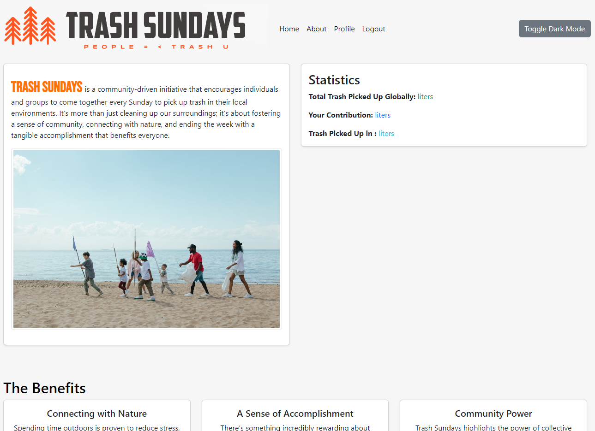

# Trash Sundays



[Live site on render](https://nordic-art-22f58cb8c917.herokuapp.com/)

[Github repository](https://github.com/adrianskelton/trashsundays)


# Table Of Content

-   [User Experience](#user-experience)
    -   [User Stories](#user-stories)
    -   [Site Goals](#site-goals)
    -   [Scope](#scope)
-   [Design](#design)
    -   [Colour Scheme](#colour-scheme)
    -   [Database Schema](#Database-Schema)
    -   [Fonts](#Fonts)
    -   [Wireframes](#Wireframes)
    -   [Agile Methodology](#Agile-Methodology)
         -   [Overview](#overview)
         -   [EPICS(Milestones)](#epicsmilestones)
         -   [User Stories issues](#user-stories-issues)
         -   [MoSCoW prioritization](#moscow-prioritization)
         -   [GitHub Projects](#github-projects)
-   [Features](#features)
    -   [Navbar](#Navbar)
    -   [Footer](#Footer)
    -   [Home](#Home)
        -   [Hero Section](#hero-section)
    -   [Products Page](#products-page)
    -   [Sign In Page](#sign-in-page)
    -   [Sign Up Page](#sign-up-page)
    -   [Sign Out Confirmation](#sign-out-confirmation)
-   [Future Features](#future-features)
-   [Marketing](#marketing)
-   [Search Engine Optimization SEO](#search-engine-optimization-seo)
-   [Testing](#testing)
-   [Technologies And Languages](#technologies-and-languages)
    -   [Languages Used](#languages-used)
    -   [Python Modules](#python-modules)
    -   [Technologies and programs](#technologies-and-programs)
-   [Deployment](#deployment)
    -   [Before Deployment](#before-deployment)
    -   [Deployment on Heroku](#deployment-on-heroku)
    -   [Creating A Fork](#creating-a-fork)
    -   [Cloning Repository](#cloning-repository)
-   [Credits](#credits)
    -   [Media](#media)
    -   [Code](#code)
    -   [Acknowledgements](#acknowledgements)
    -   [Comments](#comments)


## User Experience

## User Stories and Epics

### Account Features

- As a user, I can create an account to access personalised features and save my preferences.
- As a user, I can log into my account to access my personal settings and history, or prefill my details at checkout.
- As a user, I can log out of my account to ensure my account is secure when I'm not using it.
- As a user, I can update my account/profile to keep my personal information up to date for checking out.
- As a user, I can access and view my user profile to see my personal information, order history, and manage my account settings.

### User Features (Registered User)

- As a user I want to see my statistics of trash I have collected.
- As a user I want to connect with others in my area, (option see users by map)

### Review Features (Registered Customer)

- As a registered customer, I can create reviews for products so that I can share my experience with others.
- As a registered customer, I can update my reviews so that I can modify my feedback if my opinion changes.
- As a registered customer, I can delete my reviews so that I can remove my feedback if I no longer wish it to be displayed.

### Blog Post Features (Staff)

- As a staff member, I can create blog posts so that I can provide valuable content to customers and visitors.
- As a staff member, I can update blog posts so that I can keep the content current and relevant.
- As a staff member, I can delete blog posts so that I can remove outdated or irrelevant content.

### Comment Features (Registered Customer)

- As a registered customer, I can create comments on blog posts so that I can engage in discussions and share my thoughts.
- As a registered customer, I can update my comments so that I can change my input or correct mistakes.
- As a registered customer, I can delete my comments so that I can remove my input if I change my mind.

### Site Goals
1. To provide users with a place to purchase art prints from different artists in Sweden.
2. To provide the users the ability to search artists and style of art
3. To provide the users with the ability to view each artists profile
4. To provide the users with the ability to check their order history
5. To provide the users the ability to read blog posts
6. To provide the users with the ability to leave comments on blog posts

### Scope

Key Features:

Django community site where users record number of bags of trash they collect. Creating a community of trash collectors around the world. The site was used to showcase the power of a global communities 

Key Features of the Website:

User Authentication:
- Account creation, login, logout, and deletion.

User Profile Management:
- Account/profile update.
- User profile with a summary of orders.

E-Commerce Functionality:
- Product creation, update, and deletion.
- Add/remove products to/from the cart.
- View order summary.
- Payment processing and checkout completion.

User Interaction:

- Creation, update, and deletion of reviews.
- Blog post management, including creation, update, and deletion.
- Comment creation, update, and deletion.
- Moreover, the website will include a newsletter signup form to gather emails for marketing purposes. - Additionally, a Facebook business page will be set up to share content with customers, fostering engagement through comments and messages.

Benefits: 

This innovative website promises a myriad of benefits for users and enthusiasts. With a seamless user authentication system, customers can create and manage their accounts. The website functionality ensures a smooth navigation experience, allowing users to explore three unique models, perform test payments with Stripe, and efficiently manage their orders. The platform encourages user interaction through the creation, modification, and removal comments and via the facebook page.

The incorporation of a newsletter signup form not only keeps users informed but also supports targeted marketing initiatives. Furthermore, the integration of a Facebook business page amplifies engagement, providing a dynamic space for customers to interact and explore a wealth of content related to artists and affiliated products. Overall, this website blends convenience, interaction, and information, creating a holistic and rewarding online experience.


## Design
### Colour Scheme
The colour scheme is of the website is quite toned down as not to take away from the prints so that they are the main focus and the user experience of the website is ease of functionality in focus without color distractions in the navigation. I did this also in mind that most Scandinavian homes have subdued interior home colours and the website then mimics this.

    1. Background color usage - #d7e1ea
    2. Background color (same as boothstrap bg-lite) - #f8f9fa 


### Database Schema


### Fonts
I chose 2 fonts that look clean and minimalistic from google fonts.


**Chivo** - Used for body and some of the titles.


**Krub** - Used for headings.


### Wireframes

Included below are the wireframes I made for the most detailed pages, the account functionality and shopping pages I skipped over as they didnt require much layout planning visually and were mostly text and no images to be layed out so it would have been largely uneccessary.


<details>

<summary>Home wireframe</summary>


</details>

- The landing page will have a short writeup of Trash Sundays, thereby removing the need for an about us page which I thought of origonally. A shop now button is then underneath the text taking the users to the shop displaying all the products.

<details>
<summary>Product list wireframe</summary> 


</details>

- Product Detail
<details>
<summary>Product detail wireframe</summary> 


</details>

- The product detail page is where users can buy products, they can select the size of prints that they desire and then they can add them to their cart.

<details>
<summary>Artists wireframe</summary>


</details>

- The Artist page displays a list of artists with a short bio, a link to their website and their profile picture on the right hand side of the page.

<details>
<summary>Contact us wireframe</summary> 


</details>

- The contact us page has a basic form that allows users and guests to send the company a message, it includes an entry for their name, email and message.

<details>
<summary>Blog posts wireframe</summary> 


</details>

- The blog posts are listed full width with a read more link to access the main single post of that article.

<details>
<summary>Single blog post wireframe</summary> 


</details>

- The single blog post page displays an individual posts full details and also has a comment section for logged in users to comment on the blogs. They will have access to edit and delete their comments here. 

### Agile Methodology
#### Overview
The inception of the Trash Sundays website traces back to the establishment of a GitHub Projects Page, functioning as the central hub for project management.

This platform played a crucial role in systematically organizing tasks, creating user stories, and breaking them down into actionable steps. The primary objective was to construct a well-organized roadmap that could effectively guide the project to its successful completion within the specified timeframe. Leveraging the GitHub Projects Page facilitated the monitoring of the project's progression, task assignment, and milestone accomplishment, ensuring a streamlined and organized development process. 

The implementation of the MoSCoW method, coupled with customized GitHub project labels, proved invaluable in helping me prioritize essential tasks within the constraints of my available time.

For accessing specific details:

- To view the project Kanban board, kindly [follow this link](https://github.com/users/adrianskelton/projects/7)
- For milestones, please [follow this link]()
- To explore issues, please [follow this link](https://github.com/adrianskelton/trashsundays/issues?q=is%3Aissue)

#### Epics(Milestones)
I seperated these into the following Milestones...
- Project Setup
- User Setup
- Products
- Orders, checkout and gift card discounts
- Admin Functionality
- Artist Profile
- Marketing and SEO
- Documentation and testing


#### User Stories Issues
I tried to keep my user story issues as simple and uncomplicated as necessary. This helped me not get caught up on too many issues but focused on the design of the site and tick off the major issues in one go, I found it easier to manage personally this way.


#### MoSCoW prioritization
My board was fairly simple with Todo, In Progress, Done and Future Additions.


## Features
#### Navbar
The navigation bar remains a constant feature on every page, crafted with Bootstrap and fine-tuned for complete responsiveness. The left segment is dedicated to content navigation, while the right side pertains to user authentication. Authenticated users have additional options, whereas unauthenticated users are prompted to log in or register.

On the mobile version of the navbar, all content is revealed upon clicking a hamburger icon. Upon activation, a dropdown display appears, presenting all navigation links.


**Desktop header**


**Mobile header Closed**  


**Mobile header Expanded**


### Toasts
Toasts and shopping bag
Toast Messages play a vital role in promptly updating users on the outcomes of their actions within the e-commerce platform. Below is an overview of the implementation of Toast Messages:

**Purpose:**

Toast Messages are employed to notify users of the completion of various actions, such as successful login, product deletion, and other significant events.
They act as subtle notifications that briefly appear on the screen, ensuring users are promptly informed without disrupting their browsing experience.

**Implementation:**

The platform uses a standardized toast template to maintain consistency in appearance and functionality across different scenarios.
Specifically, the toast success template is applied to the bag preview popup, ensuring visual coherence and reinforcing positive feedback for successful bag updates.

**User Interaction:**

User login and all shopping done and changes made to the shopping bag are then displayed with toasts on the right hand corner. This allows the user to click on the messages and make changes but also have a clear idea of their shopping and navigation experience.


#### Footer

The footer is divided into two columns with the mailchimp mailing list form on the left and the social icons for github and facebook on the right. 
The facebook link only opens to facebook as I deleted the facebook page shortly after creating it as facebook has a policy of creating fake pages. 


### Home Page
#### Hero Section
The hero section has a brief description of what web site is about and then has a shop now button which will take the user to the shop where all the prints will be displayed. There is also an image of the listed artists on the right hand side of the text.


#### Products
The products page shows all the products with the artist name and category below the image. This image is clickable and follows to the individual product page where the product can then be added to the cart. The product page also has a sort by button dropdown that 


### Products Page
I made a way to update the prices of the products in a batch manner instead of doing the tedious changes one by one. I did this by using djangos basecommand feature. 
I then made simple script to do this. 


### Products Card
The product card is very simple and shows the image of the print, print name, artist, and category.


### Single Products Page
The single product page shows the main image, product writeup, category and the price/sizing options. You can then select the number of prints you want and clicking add to bag or click keep shopping to choose something else.


### Contact Us Page
The contact page is a simple contact form with your name, email and message box. An image of a photography exhibition is to the right. 


### Artists Page (custom model)
In the left column the artists name, bio and website are displayed as well as a scrollable display of their prints as images. When you hover over the print it displays a link to buy now which can be clicked to see the single product detail page. The artists image is shown on the right column. 


#### My Profile
This page shows the users order history on the right and the users address details on the left column. 


### Shopping bag
This page shows a breakdown of what the user has put in their shopping back and also allows deletion or editing of the shopping bag. From this page the user can checkout or continue shopping. 


Admin dashboard:


## Future Features

A few of the features that would be applied in future. 
- Giftcards available to purchase and send to friends online, thereby growing the community and generating more sales.
- Add a mailing list when the number of users has increased more
- Youtube social media channel with regular content creation


## Search Engine Optimization SEO and Marketing

### Business Model

**Business Type:** Business to Customer (B2C)

Nature of Business: Trash Sundays operates as an online print shop specializing in the sale of digital and photo prints to individual customers.

**Revenue Streams:**

- Sales Revenue: Generated through the direct sale of digital and photo prints to customers. 
- Advertising Revenue: Potential income from sponsored content or advertisements displayed on the website.
- Affiliate Marketing Revenue: By signing up to affiliate websites there is potential to make commission from click through ads to other websites.

**Customer Segments:**

- Art Enthusiasts: Individuals interested in purchasing high-quality digital and photo prints for personal use or decoration.
- Gift Shoppers: Individuals looking to buy art prints as gifts for friends, family, or colleagues.

**Value Proposition:**

- Artistic Excellence: Offering a diverse range of high-quality digital and photo prints sourced from talented artists and photographers.
- Convenience: Providing a user-friendly online platform for customers to explore, purchase, and receive prints from the comfort of their homes.
- Community Engagement: Building a community of art lovers through social media engagement, fostering a sense of belonging and loyalty.

**Channels:**

- E-commerce Website: The primary platform for showcasing prints, processing orders, and facilitating transactions.
- Social Media: Utilizing platforms such as Instagram, Pinterest, and Twitter for marketing, customer engagement, and community building.
- Newsletter: Sending regular updates, promotions, and announcements to subscribers via email.

**Customer Relationships:**

- Personalized Support: Offering responsive customer support to address inquiries, provide assistance, and resolve issues promptly.
- Engagement: Actively engaging with customers through social media interactions, responding to comments, and sharing user-generated content.

**Key Activities:**

- Artwork Curation: Identifying and curating a diverse collection of digital and photo prints from talented artists and photographers.
- Website Management: Maintaining and updating the e-commerce platform to ensure a seamless shopping experience for customers.
- Marketing and Promotion: Implementing marketing strategies to attract new customers, retain existing ones, and promote brand awareness.

**Key Resources:**

- E-commerce Platform: Investing in a robust and user-friendly website for online sales and transactions.
- Social Media Presence: Building and maintaining an active presence on social media platforms to engage with customers and drive traffic to the website.

**Cost Structure:**

- Artwork Costs: Expenses related to acquiring digital and photo prints from artists and photographers.
- Website Maintenance: Costs associated with hosting, domain registration, website development, and maintenance.
- Marketing Expenses: Budget allocated for advertising, promotions, and social media marketing campaigns.

**Key Partnerships:**

- Artists and Photographers: Establishing partnerships with talented creators to ensure a consistent supply of unique and appealing prints. This relationship is vital as the happier the artists are and the strength of the relationship will foster good marketing from their side too for the website and brand.
- Delivery Services: Collaborating with reliable shipping and delivery services to fulfill customer orders efficiently and reliably.
- Influencers and Affiliates: Partnering with art influencers or affiliates to promote prints and reach a broader audience.

**Growth Strategies:**

- Expansion of Print Range: Continuously adding new and innovative prints to cater to evolving customer preferences and trends.

- Geographic Expansion: Scaling operations to reach new geographic markets and expand the customer base. (Norway, Denmark and other Nordic countries added later targeting only the best artists)
- Customer Loyalty Programs: Implementing loyalty programs, discounts, and rewards to incentivize repeat purchases and foster customer loyalty.


### SEO

The keywords I tried to focus on were "sweden photo prints", "swedish artists" and other non generic longer keywords as the internet is already flooded with art print sites, I wanted the keywords to zero in on the geographical location as this is where the marketing will be and it is part of the brand. 

The content in the blog section also uses the artists name and the keywords of prints and order to help push the seo quality up.

The alt image descriptions were also thought of with the artists name and name of the print. The meta keywords were filled with again geographic based keywords including sweden and nordic in the keywords as well as the artists names.


### Marketing


I made a facebook business page for my site as I felt that was the best way to engage with a large audience and build up a clientbase organically. As most artists are on facebook and have their own social media pages, the business facebook page could then link up to all of theirs and generate interest by the artists also promoting Trash Sundays and visa versa. Regular posts to the page such as new art, interviews with artists and other art related articles could be posted both on the site at a later stage in development and then shared on social media via the business page. 


## Testing
Testing documentation can be found [here.](TESTING.md)

## Technologies And Languages

### Languages Used
- HTML
- CSS
- JavaScript
- jQuery
- Bootstrap
- Python
- Django

### Python Modules

### Technologies and programs
 - [Favicon Generator](https://favicon.io/favicon-converter/) was used to generate Favicon
 - [Image to Webp](https://tiny-img.com/webp/)


# Deployment

The live deployed application can be found deployed on [Heroku](https://nordic-art-22f58cb8c917.herokuapp.com).

### ElephantSQL Database

This project uses [ElephantSQL](https://www.elephantsql.com/) for the PostgreSQL Database.

To obtain your own Postgres Database, sign-up with your GitHub account, then follow these steps:

- Click **Create New Instance** to start a new database.
- Provide a name 
- Select the **Tiny Turtle (Free)** plan.
- You can leave the **Tags** blank.
- Select the **Region** and **Data Center** closest to you.
- Once created, click on the new database name, where you can view the database URL and Password.

### Amazon AWS

This project uses [AWS](https://aws.amazon.com/) to store media and static files online, due to the fact that Heroku doesn't persist this type of data.

Once you've created an AWS account and logged-in, follow these series of steps to get your project connected. Make sure you're on the **AWS Management Console** page.

#### S3 Bucket

- Search for **S3**.
    
- Create a new bucket, give it a name (matching your Heroku app name), and choose the region closest to you.
    
- Uncheck **Block all public access**, and acknowledge that the bucket will be public (required for it to work on Heroku).
    
- From **Object Ownership**, make sure to have **ACLs enabled**, and **Bucket owner preferred** selected.
    
- From the **Properties** tab, turn on static website hosting, and type `index.html` and `error.html` in their respective fields, then click **Save**.
    
- From the **Permissions** tab, paste in the following CORS configuration:
    
    ```shell
     [
     	{
     		"AllowedHeaders": [
     			"Authorization"
     		],
     		"AllowedMethods": [
     			"GET"
     		],
     		"AllowedOrigins": [
     			"*"
     		],
     		"ExposeHeaders": []
     	}
     ]
    ```
    
- Copy your **ARN** string.
    
- From the **Bucket Policy** tab, select the **Policy Generator** link, and use the following steps:
    
    - Policy Type: **S3 Bucket Policy**
        
    - Effect: **Allow**
        
    - Principal: `*`
        
    - Actions: **GetObject**
        
    - Amazon Resource Name (ARN): **paste-your-ARN-here**
        
    - Click **Add Statement**
        
    - Click **Generate Policy**
        
    - Copy the entire Policy, and paste it into the **Bucket Policy Editor**
        
        ```shell
         {
         	"Id": "Policy1234567890",
         	"Version": "2012-10-17",
         	"Statement": [
         		{
         			"Sid": "Stmt1234567890",
         			"Action": [
         				"s3:GetObject"
         			],
         			"Effect": "Allow",
         			"Resource": "arn:aws:s3:::your-bucket-name/*"
         			"Principal": "*",
         		}
         	]
         }
        ```
        
    - Before you click "Save", add `/*` to the end of the Resource key in the Bucket Policy Editor (like above).
        
    - Click **Save**.
        
- From the **Access Control List (ACL)** section, click "Edit" and enable **List** for **Everyone (public access)**, and accept the warning box.
    
    - If the edit button is disabled, you need to change the **Object Ownership** section above to **ACLs enabled** (mentioned above).

#### IAM

Back on the AWS Services Menu, search for and open **IAM** (Identity and Access Management). Once on the IAM page, follow these steps:

- From **User Groups**, click **Create New Group**.
    - Suggested Name: `group-nordic-art` (group + the project name)
- Tags are optional, but you must click it to get to the **review policy** page.
- From **User Groups**, select your newly created group, and go to the **Permissions** tab.
- Open the **Add Permissions** dropdown, and click **Attach Policies**.
- Select the policy, then click **Add Permissions** at the bottom when finished.
- From the **JSON** tab, select the **Import Managed Policy** link.
    - Search for **S3**, select the `AmazonS3FullAccess` policy, and then **Import**.
        
    - You'll need your ARN from the S3 Bucket copied again, which is pasted into "Resources" key on the Policy.
        
        ```shell
         {
         	"Version": "2012-10-17",
         	"Statement": [
         		{
         			"Effect": "Allow",
         			"Action": "s3:*",
         			"Resource": [
         				"arn:aws:s3:::your-bucket-name",
         				"arn:aws:s3:::your-bucket-name/*"
         			]
         		}
         	]
         }
        ```
        
    - Click **Review Policy**.
        
    - Suggested Name: `policy-nordic-art` (policy + the project name)
        
    - Provide a description:
        
        - "Access to S3 Bucket for nordic-art static files."
    - Click **Create Policy**.
        
- From **User Groups**, click your "group-nordic-art".
- Click **Attach Policy**.
- Search for the policy you've just created ("policy-nordic-art") and select it, then **Attach Policy**.
- From **User Groups**, click **Add User**.
    - Suggested Name: `user-nordic-art` (user + the project name)
- For "Select AWS Access Type", select **Programmatic Access**.
- Select the group to add your new user to: `group-nordic-art`
- Tags are optional, but you must click it to get to the **review user** page.
- Click **Create User** once done.
- You should see a button to **Download .csv**, so click it to save a copy on your system.
    - **IMPORTANT**: once you pass this page, you cannot come back to download it again, so do it immediately!
    - This contains the user's **Access key ID** and **Secret access key**.
    - `AWS_ACCESS_KEY_ID` = **Access key ID**
    - `AWS_SECRET_ACCESS_KEY` = **Secret access key**

#### Final AWS Setup

- If Heroku Config Vars has `DISABLE_COLLECTSTATIC` still, this can be removed now, so that AWS will handle the static files.
- Back within **S3**, create a new folder called: `media`.
- Select any existing media images for your project to prepare them for being uploaded into the new folder.
- Under **Manage Public Permissions**, select **Grant public read access to this object(s)**.
- No further settings are required, so click **Upload**.

### Stripe API

This project uses [Stripe](https://stripe.com/) to handle the ecommerce payments.

Once you've created a Stripe account and logged-in, follow these series of steps to get your project connected.

- From your Stripe dashboard, click to expand the "Get your test API keys".
- You'll have two keys here:
    - `STRIPE_PUBLIC_KEY` = Publishable Key (starts with **pk**)
    - `STRIPE_SECRET_KEY` = Secret Key (starts with **sk**)

As a backup, in case users prematurely close the purchase-order page during payment, we can include Stripe Webhooks.

- From your Stripe dashboard, click **Developers**, and select **Webhooks**.
- From there, click **Add Endpoint**.
    - `https://nordic-art-22f58cb8c917.herokuapp.com/checkout/wh/`
- Click **receive all events**.
- Click **Add Endpoint** to complete the process.
- You'll have a new key here:
    - `STRIPE_WH_SECRET` = Signing Secret (Wehbook) Key (starts with **wh**)

### Gmail API

This project uses [Gmail](https://mail.google.com/) to handle sending emails to users for account verification and purchase order confirmations.

Once you've created a Gmail (Google) account and logged-in, follow these series of steps to get your project connected.

- Click on the **Account Settings** (cog icon) in the top-right corner of Gmail.
- Click on the **Accounts and Import** tab.
- Within the section called "Change account settings", click on the link for **Other Google Account settings**.
- From this new page, select **Security** on the left.
- Select **2-Step Verification** to turn it on. (verify your password and account)
- Once verified, select **Turn On** for 2FA.
- Navigate back to the **Security** page, and you'll see a new option called **App passwords**.
- This might prompt you once again to confirm your password and account.
- Select **Mail** for the app type.
- Select **Other (Custom name)** for the device type.
    - Any custom name, such as "Django" or nordic-art
- You'll be provided with a 16-character password (API key).
    - Save this somewhere locally, as you cannot access this key again later!
    - `EMAIL_HOST_PASS` = user's 16-character API key
    - `EMAIL_HOST_USER` = user's own personal Gmail email address

### Heroku Deployment

This project uses [Heroku](https://www.heroku.com/), a platform as a service (PaaS) that enables developers to build, run, and operate applications entirely in the cloud.

Deployment steps are as follows, after account setup:

- Select **New** in the top-right corner of your Heroku Dashboard, and select **Create new app** from the dropdown menu.
- Your app name must be unique, and then choose a region closest to you (EU or USA), and finally, select **Create App**.
- From the new app **Settings**, click **Reveal Config Vars**, and set your environment variables.

| Key | Value |
| --- | --- |
| `AWS_ACCESS_KEY_ID` | user's own value |
| `AWS_SECRET_ACCESS_KEY` | user's own value |
| `DATABASE_URL` | user's own value |
| `DISABLE_COLLECTSTATIC` | 1 (_this is temporary, and can be removed for the final deployment_) |
| `EMAIL_HOST_PASS` | user's own value |
| `EMAIL_HOST_USER` | user's own value |
| `SECRET_KEY` | user's own value |
| `STRIPE_PUBLIC_KEY` | user's own value |
| `STRIPE_SECRET_KEY` | user's own value |
| `STRIPE_WH_SECRET` | user's own value |
| `USE_AWS` | True |

Heroku needs two additional files in order to deploy properly.

- requirements.txt
- Procfile

You can install this project's **requirements** (where applicable) using:

- `pip3 install -r requirements.txt`

If you have your own packages that have been installed, then the requirements file needs updated using:

- `pip3 freeze --local > requirements.txt`

The **Procfile** can be created with the following command:

- `echo web: gunicorn app_name.wsgi > Procfile`
- _replace **app\_name** with the name of your primary Django app name; the folder where settings.py is located_

For Heroku deployment, follow these steps to connect your own GitHub repository to the newly created app:

Either:

- Select **Automatic Deployment** from the Heroku app.

Or:

- In the Terminal/CLI, connect to Heroku using this command: `heroku login -i`
- Set the remote for Heroku: `heroku git:remote -a app_name` (replace _app\_name_ with your app name)
- After performing the standard Git `add`, `commit`, and `push` to GitHub, you can now type:
    - `git push heroku main`

The project should now be connected and deployed to Heroku!

### Local Deployment

This project can be cloned or forked in order to make a local copy on your own system.

For either method, you will need to install any applicable packages found within the _requirements.txt_ file.

- `pip3 install -r requirements.txt`.

You will need to create a new file called `env.py` at the root-level, and include the same environment variables listed above from the Heroku deployment steps.

Sample `env.py` file:

```python
import os

os.environ.setdefault("AWS_ACCESS_KEY_ID", "user's own value")
os.environ.setdefault("AWS_SECRET_ACCESS_KEY", "user's own value")
os.environ.setdefault("DATABASE_URL", "user's own value")
os.environ.setdefault("EMAIL_HOST_PASS", "user's own value")
os.environ.setdefault("EMAIL_HOST_USER", "user's own value")
os.environ.setdefault("SECRET_KEY", "user's own value")
os.environ.setdefault("STRIPE_PUBLIC_KEY", "user's own value")
os.environ.setdefault("STRIPE_SECRET_KEY", "user's own value")
os.environ.setdefault("STRIPE_WH_SECRET", "user's own value")

# local environment only (do not include these in production/deployment!)
os.environ.setdefault("DEBUG", "True")
```

Once the project is cloned or forked, in order to run it locally, you'll need to follow these steps:

- Start the Django app: `python3 manage.py runserver`
- Stop the app once it's loaded: `CTRL+C` or `⌘+C` (Mac)
- Make any necessary migrations: `python3 manage.py makemigrations`
- Migrate the data to the database: `python3 manage.py migrate`
- Create a superuser: `python3 manage.py createsuperuser`
- Load fixtures (if applicable): `python3 manage.py loaddata file-name.json` (repeat for each file)
- Everything should be ready now, so run the Django app again: `python3 manage.py runserver`

If you'd like to backup your database models, use the following command for each model you'd like to create a fixture for:

- `python3 manage.py dumpdata your-model > your-model.json`
- _repeat this action for each model you wish to backup_

#### Cloning

You can clone the repository by following these steps:

1. Go to the [GitHub repository](https://github.com/adrianskelton/trashsundays)
2. Locate the Code button above the list of files and click it
3. Select if you prefer to clone using HTTPS, SSH, or GitHub CLI and click the copy button to copy the URL to your clipboard
4. Open Git Bash or Terminal
5. Change the current working directory to the one where you want the cloned directory
6. In your IDE Terminal, type the following command to clone my repository:
    - `git clone https://github.com/adrianskelton/trashsundays.git` 
7. Press Enter to create your local clone.

Alternatively, if using Gitpod, you can click below to create your own workspace using this repository.

Please note that in order to directly open the project in Gitpod, you need to have the browser extension installed. A tutorial on how to do that can be found [here](https://www.gitpod.io/docs/configure/user-settings/browser-extension).

#### Forking

By forking the GitHub Repository, we make a copy of the original repository on our GitHub account to view and/or make changes without affecting the original owner's repository. You can fork this repository by using the following steps:

1. Log in to GitHub and locate the [GitHub Repository](https://github.com/adrianskelton/trashsundays)
2. At the top of the Repository (not top of page) just above the "Settings" Button on the menu, locate the "Fork" Button.
3. Once clicked, you should now have a copy of the original repository in your own GitHub account!


## Credits


### Media


### Code


### Acknowledgements


### Comments


